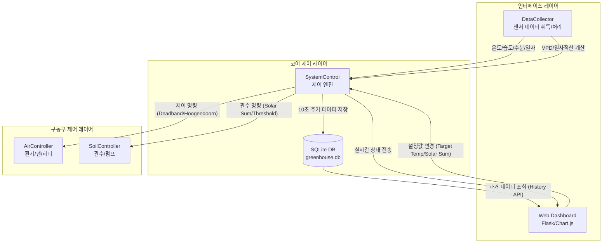

# Berry_WHAT 시스템 제어 구조도

본 문서는 현재 구현된 스마트 온실 제어 시스템의 구성 요소와 데이터 흐름을 설명합니다.

## 1. 시스템 구조도 (Mermaid)

## 2. 주요 구성 요소 설명

### [인터페이스 레이어]
*   **DataCollector (`interface/collector.py`)**: 
    *   센서 신호를 수집하고 가공합니다.
    *   **VPD(포차)** 및 **일사 적산량(Solar Accumulation)**을 실시간으로 계산하는 수학적 로직을 포함합니다.
*   **Web Dashboard (`web/app.py`)**:
    *   사용자에게 한글화된 모니터링 화면을 제공합니다.
    *   Chart.js를 이용해 온도/수분 변화 추이를 그래프로 표시합니다.

### [코어 제어 레이어]
*   **SystemControl (`core/logic.py`)**: 
    *   시스템의 '두뇌' 역할을 하며 두 가지 주요 알고리즘을 실행합니다.
    *   **Deadband Logic**: 설정 온도와 실제 온도의 차이에 따라 공조 장치를 제어합니다.
    *   **Hoogendoorn Logic**: 누적 일사량 기반 관수 및 토양 수분 기반 안전 제어를 수행합니다.
*   **DatabaseManager (`core/db.py`)**:
    *   SQLite를 사용하여 센서 이력을 영구 저장하고 분석용 데이터를 제공합니다.

### [구동부 제어 레이어]
*   **AirController (`control/air.py`)**: 환기창, 환풍기, 히터, 미스트 등 기상 환경 제어 장치를 구동합니다.
*   **SoilController (`control/soil.py`)**: 관수 펌프 및 밸브를 제어하여 토양 환경을 최적화합니다.

## 3. 제어 시퀀스
1. `DataCollector`가 2초 주기로 센서 값을 읽고 가공합니다.
2. `SystemControl`이 가공된 데이터를 분석하여 제어 전략을 결정합니다.
3. 결정된 전략에 따라 `Air/Soil Controller`가 물리적 장치를 구동합니다.
4. 모든 상태는 `Web Dashboard`에 실시간으로 반영되며, 10초마다 `DB`에 기록됩니다.
