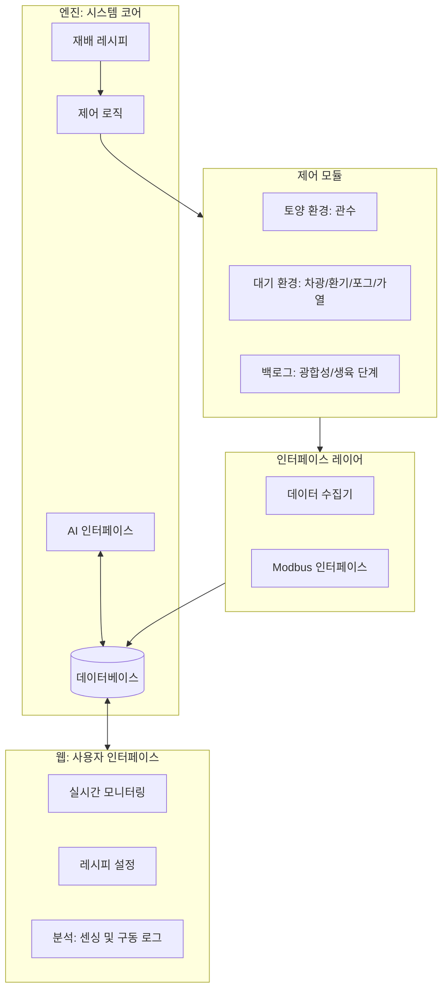

# 온실 제어 시스템 설계도 (초안)

이 다이어그램은 시스템의 초기 설계 구조를 나타냅니다.

```mermaid
graph TD
    subgraph Engine [엔진: 시스템 코어]
        AI[AI 인터페이스]
        DB[(데이터베이스)]
        Rules[재배 레시피]
        Control[제어 로직]
    end

    subgraph Control_Detail [제어 모듈]
        Soil[토양 환경: 관수]
        Air[대기 환경: 차광/환기/포그/가열]
        Future[백로그: 광합성/생육 단계]
    end

    subgraph Signal [인터페이스 레이어]
        Collector[데이터 수집기]
        Modbus[Modbus 인터페이스]
    end

    subgraph Web [웹: 사용자 인터페이스]
        Monitor[실시간 모니터링]
        Config[레시피 설정]
        Report[분석: 센싱 및 구동 로그]
    end

    %% 데이터 흐름
    Signal --> DB
    Rules --> Control
    Control --> Control_Detail
    Control_Detail --> Signal
    AI <--> DB
    DB <--> Web
```
